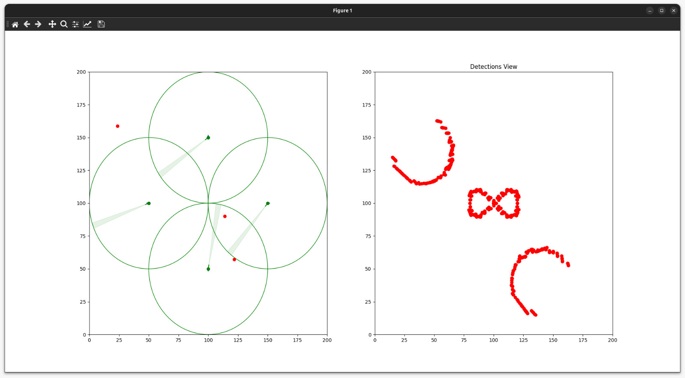

# Practica Entregable 2 - Tiempo Real

Este repositorio contiene el código de la práctica entregable "Tiempo Real" de
la asignatura Software Avanzado Radar (SARA) del Master en Sistemas Radar.

El repositorio contiene las siguientes carpetas:

- `app`: contiene el archivo main.py para ejecutar la aplicación y ficheros
relacionados con el código de la aplicación.
- `app/src`: contiene cada uno de los paquetes de python que usaremos durante el
  desarrollo de la práctica dividido de forma básica por las diferentes
  funcionalidades.
  - `actors`: contiene las distintas clases con la lógica de funcionamiento
  principal de la práctica
  - `helpers`: contiene archivos con funcionalidades generales del proyecto que
  pueden ser utilizada por cualquier clase principal.
  - `models`: contine clases que actuan como modelos de datos del proyecto.
  - `monitors`: contiene las clases relacionadas con la implementación de los
  monitores de la práctica.

## Escenario de la práctica

El escenario de la práctica consiste en una implementación de un modelo
digital de un radar. Además del modelo del radar también existe un modelo
digital de puntos con distintas características que pueden ser detectados por
el radar. Presenta la misma estructura e implementación que en la
[Práctica Guiada 2](https://github.com/SARA-MSRA-UPM/PG2_tiempo_real).

## Ejecución

El primer paso para poder ejecutar la práctica y comprobar su funcionamiento
será la creación de un entorno virtual propio del proyecto. Normalmente el IDE
al no encontrar un entorno virtual creado preguntará automáticamente si se desea
crearlo. En cualquier caso se pude crear utilizando los siguientes comandos:

- Linux

```shell
python3 -m venv .venv
source .venv/bin/activate
```

- Windows

```powershell
python3 -m venv venv
venv\Scripts\Activate.ps1
```

Una vez creado el entorno virtual es necesario instalar las dependencias propias
del proyecto. Las dependencias están definidas en el fichero `requirements.txt`.
Generalmente hay opciones para instalarlas de forma automática desde el IDE,
pero también se pueden instalar manualmente utilizando el siguiente comando:

```shell
pip install -r requirements.txt
```

Por último tras instalar las dependencias necesarias en nuestro entorno virtual
podemos arrancar el proceso principal de nuestro proyecto ejecutando el fichero
`app/main.py`.

```shell
python3 app/main.py
```

## Objetivos a realizar

1. **Visualización de las detecciones de los radares** El objetivo principal de
esta práctica entregable es la visualización de las detecciones de generadas por
los distintos radares. Para esto se pide añadir una gráfica extra en la misma
ventana donde se puede visualizar la animación de los puntos y radares en
movimiento. Esta nueva gráfica no necesita animación, únicamente debe reflejar
el conjunto completo de detecciones de los radares (mostrar cada punto detectado).

2. **Opcional** Adicionalmente al objetivo principal se plantea a los alumnos
añadir modificaciones. Estas modificaciones adicionales serán valoradas
positivamente en la nota final. Se valorará la originalidad y complejidad de
las mejoras. A continuación se proponen posibles modificaciones que incluir
aunque se permite una elección libre y creativa.

   - Código de colores para las detecciones en función del radar origen.
   - Implementación visual de la
   [Práctica Entregable 1](https://github.com/SARA-MSRA-UPM/PE1_concurrencia)
   con el algoritmo de búsqueda de puntos comunes o clusteres.
   - Nueva gráfica que muestre el número de detecciones de los radares en base
   unidad de tiempo.
   - Inclusión de una leyenda de colores en la ventana de visualización.
   - Creación de animaciones en formato `GIF`.


